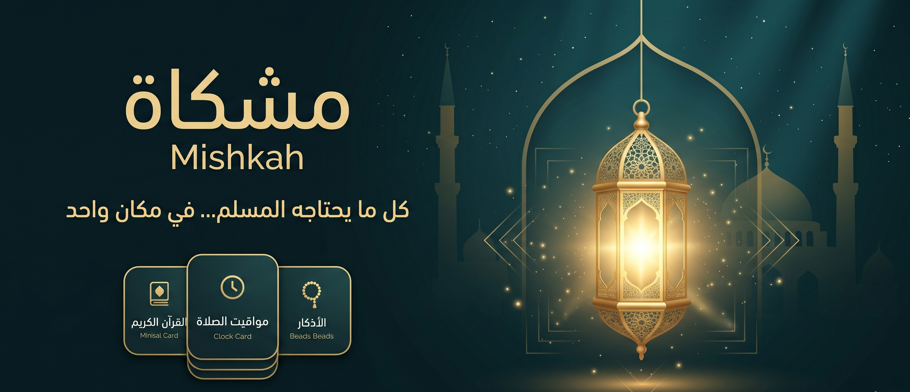
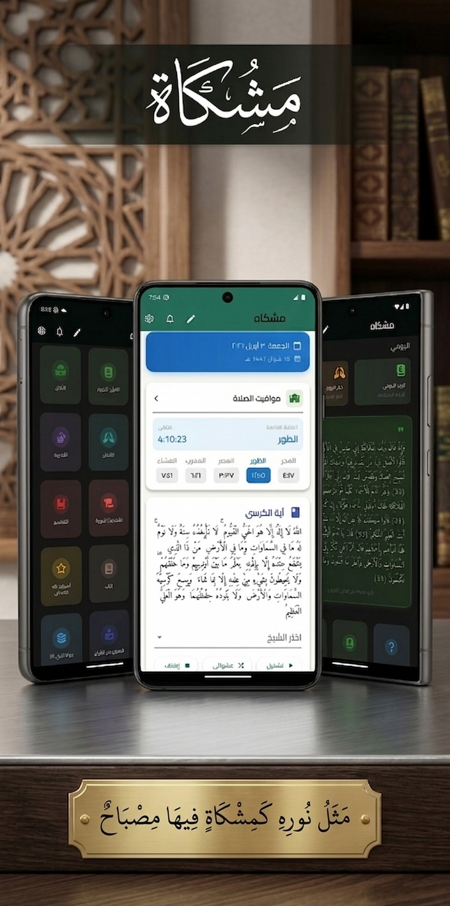
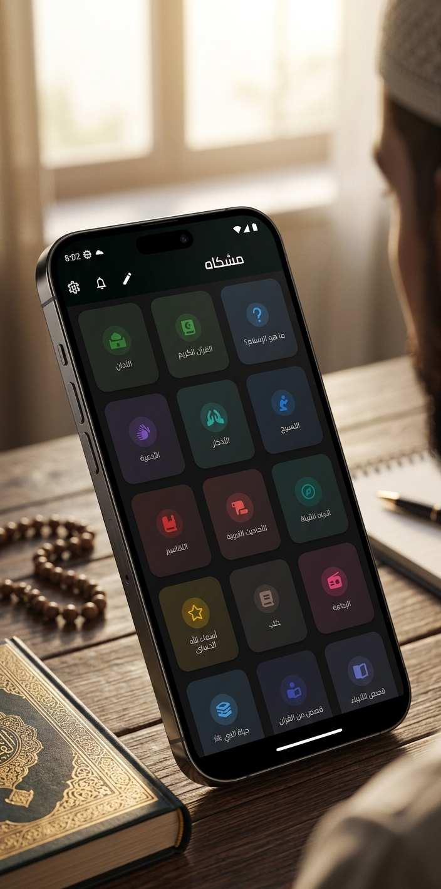
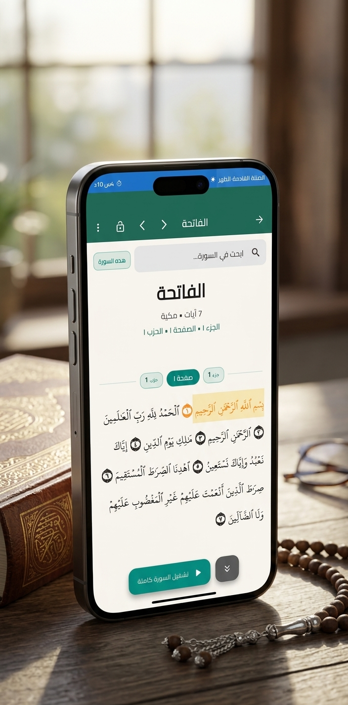
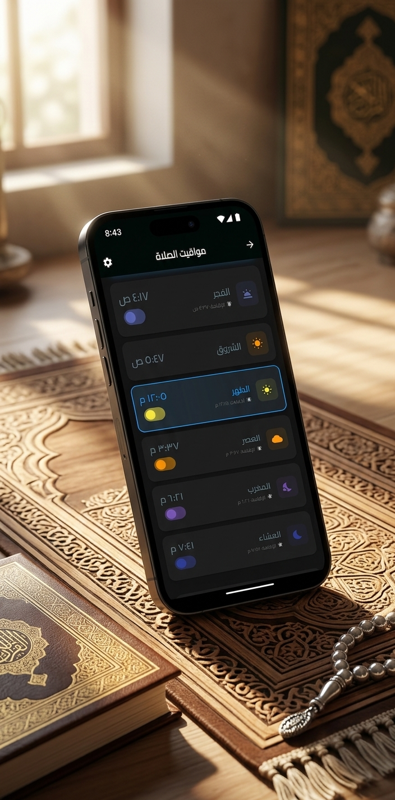
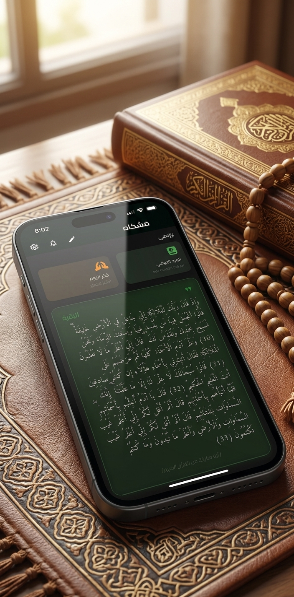
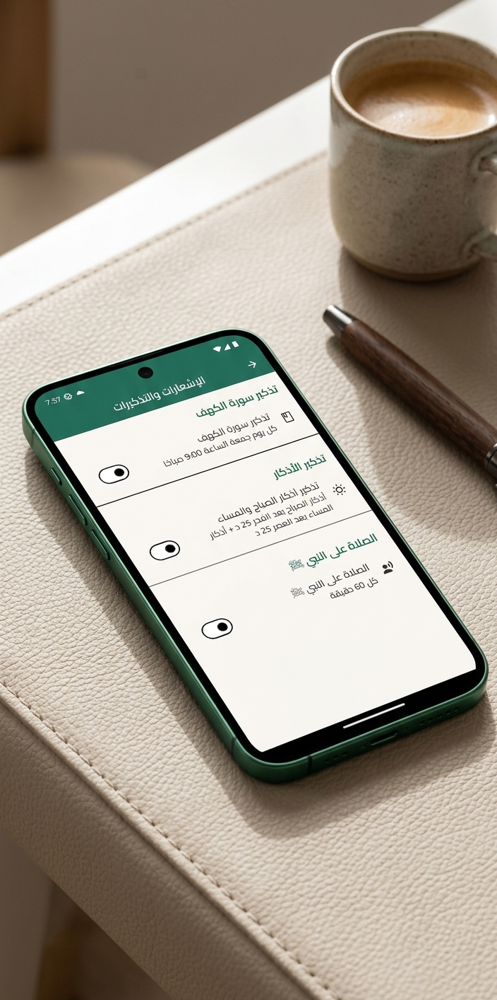
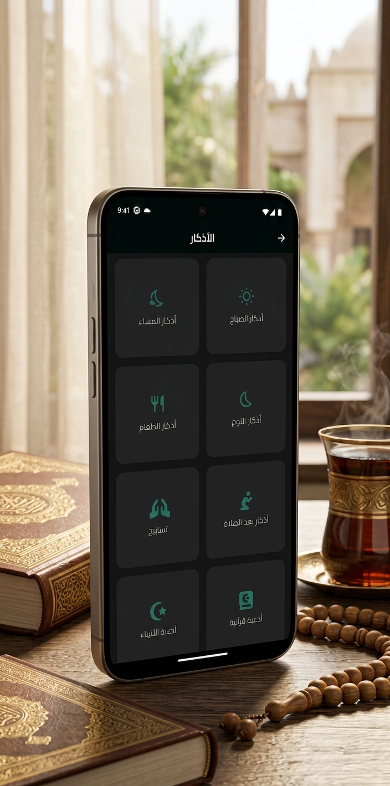
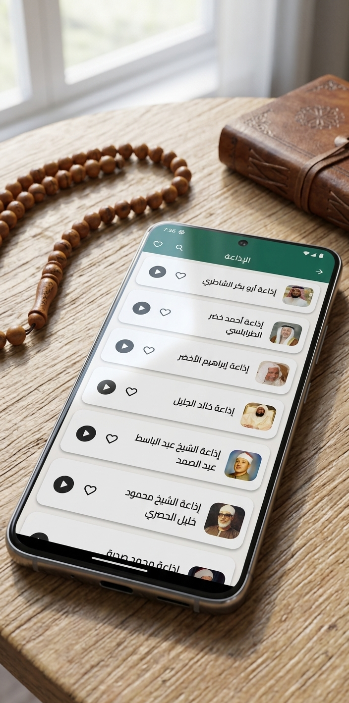

# 🕌 Mishkah | مشكاة  
### 🌙 The Complete Islamic Companion — Quran • Prayer • Knowledge • Life

  

  
  
  
  

  
  
  

---

  <b>Mishkah (مشكاة)</b> is not just an app —  
  it is a complete Islamic universe that accompanies you in every moment of your spiritual journey.

  📖 Quran • 🕌 Prayer • 🤲 Azkar • 📚 Knowledge • 🧠 Learning • 📡 Live Content • 🕋 Worship Tools

🔗 <a href="https://bugmaker69.github.io/About-Mishkah-App/">Official Website</a>  
🔒 <a href="https://bugmaker69.github.io/About-Mishkah-App/privacy.html">Privacy Policy</a>

---

# 🚀 Highlights

- 📖 Full Quran Experience with audio, tafsir, auto-scroll & offline support
- 🕌 Accurate Prayer Times for all countries and cities
- ❤️ Interactive Quran Progress Heart Tracker
- 📅 Smart Islamic Events & Hijri Calendar
- 📚 Massive Islamic Knowledge Library
- 📻 Live Islamic Radio & Background Playback
- 🧠 Multi-Level Islamic Quiz System
- 📤 Advanced PDF & Media Sharing
- 🌙 Smart Notifications & Worship Reminders
- 🕋 Qibla Compass with Accuracy Detection
- 📱 Beautiful Islamic UI with Dark Mode Support

---

# 📸 Screenshots

  
  

  
  

  
  

  
  

---

# 📲 Download

---

# ✨ Why Mishkah?

Mishkah is built to be a **daily Islamic companion** that connects every aspect of a Muslim’s life in one unified experience:

- Worship
- Learning
- Reflection
- Tracking progress
- Sharing good deeds
- Building consistency

---

# 🌙 Core Islamic Experience

## 📖 The Holy Quran (Full Experience)
- Complete Quran with multiple reciters
- Download full Quran or single Surah
- Online + Offline playback
- Smart audio engine:
  - Play from device or stream
  - Start from any Ayah or full Surah
- Auto-scroll while reciting
- Mushaf-like page viewing (real paper experience)
- Surah navigation (Pages / Juz / Hizb / Surahs)
- Advanced search:
  - Entire Quran search
  - Surah search
  - Ayah search
- Screen lock mode while reading (no accidental touches)
- Surah details card (information + insights)
- Favorites system
- Beautiful sharing:
  - Ayah image
  - Audio only
  - Audio + image
  - Video (Ayah + Tafsir)
- Tafsir support:
  - Al-Muyassar
  - Ibn Kathir
  - Al-Qurtubi
  - Al-Saadi
  - I’rab Al-Quran

---

## ❤️ Quran Progress System (Heart Tracker)
- Interactive heart-based visualization of all Surahs
- Memorization & revision tracking
- Color-coded progress system
- Full Quran completion tracking
- Motivational completion experience
- PDF export support

---

## 🕌 Prayer Times System (Global Accuracy)
- Accurate prayer times for all countries & cities
- Multiple calculation methods
- Monthly prayer calendar
- Full yearly schedule
- Share prayer timetable as PDF
- Smart Azan controls
- Pre-Azan notifications
- Iqama reminders
- Live next prayer countdown
- Dynamic timezone handling

---

## 📅 Islamic Calendar & Events
- Hijri & Gregorian calendar
- Ramadan, Eid, Arafah & Dhul Hijjah support
- Context-aware event system
- Seasonal Islamic decorations
- PDF sharing support

---

## 🤲 Azkar & Daily Worship
- Morning & Evening Azkar
- Sleep & daily Azkar
- Quranic & Prophetic Duas
- Smart reminders

---

## 📿 Digital Tasbeeh
- Interactive tasbeeh counter
- Vibration support
- Statistics & tracking system

---

## 📚 Islamic Knowledge Universe
- Hadith collections
- Tafsir libraries
- Islamic books
- Prophet stories
- Sahabah stories
- Islamic history
- Hajj & Umrah guides
- Fatwas & Islamic Q&A

---

## 🧠 Islamic Learning System
- Multi-category quizzes
- 3 difficulty levels
- Random question generation
- Analytics & score history

---

## 🧭 Qibla Direction
- High-precision Qibla compass
- Real-time alignment detection

---

## 📡 Islamic Radio & Media
- Live Islamic stations
- Background playback
- Notifications integration
- Favorites support

---

## 🏡 Your Paradise Assets
- Spiritual rewards visualization
- Daily dhikr progress
- Personal Islamic achievements dashboard

---

## 📥 Personal Content Management
Users can:
- Add personal notes
- Add PDFs
- Add YouTube links
- Save custom duas
- Edit & manage content

---

## 🔔 Smart Notifications
- Friday Surah Al-Kahf reminder
- Azkar reminders
- Prayer reminders
- Qiyam Al-Layl reminders
- Salawat reminders

---

## 🌍 Personalization
- Arabic & English support
- Dark & Light themes
- Font size customization
- Rearrangeable home layout
- Independent Quran settings

---

## 📤 Advanced Sharing System
- Ayah cards
- Audio sharing
- Video generation
- Tafsir sharing
- PDF exports
- Beautiful Islamic templates

---

## 📱 Supported Platforms
- Android
- iOS (Ready)
- Tablets

---

# 🌙 Final Vision

Mishkah is built to be:

> 🕌 A complete Islamic lifestyle ecosystem  
> 📖 A Quran companion  
> 🤲 A spiritual tracker  
> 🧠 A knowledge library  
> 🕋 A worship assistant  
> 🌙 A daily guide for every Muslim

---

# ⭐ Support Mishkah

If you like this project, consider giving it a ⭐ on GitHub  
and sharing it with others to help spread beneficial Islamic knowledge.

  

---

  <b>Made with ❤️ for the Ummah</b>

---

## 🌐 Explore Mishkah

